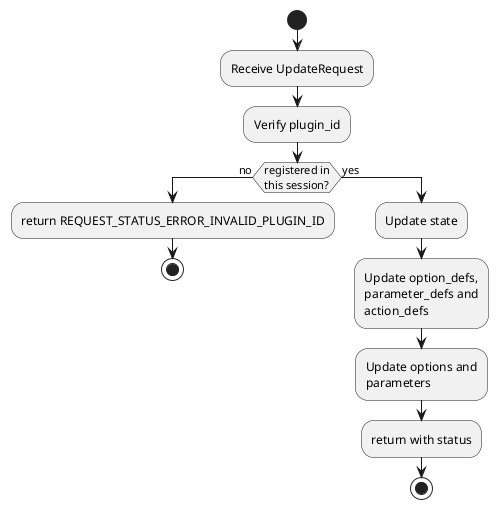
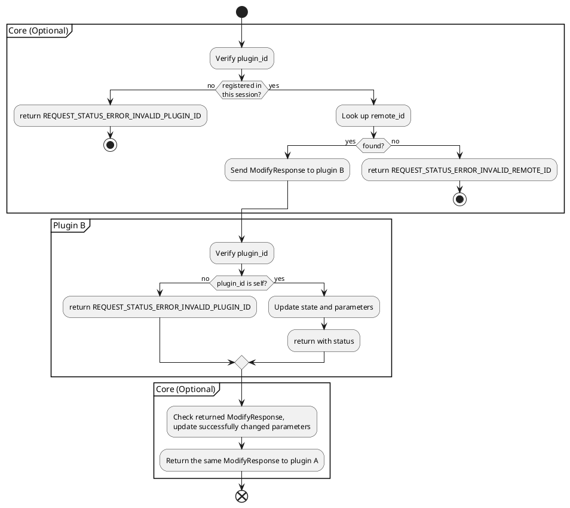
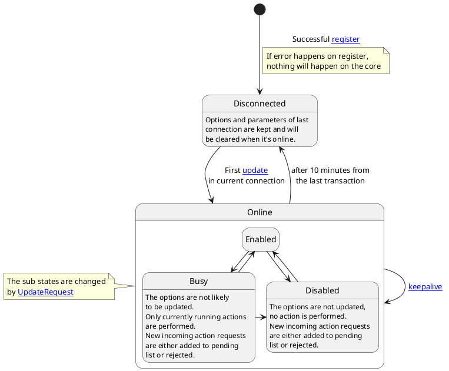

# Proper names

## Core

todo

## Plugin

todo

## Option

todo

## Parameter

todo

## Action

todo

## Session

todo

## Transaction

todo

# Messages

See `schema/*/*.proto`

# Transactions

## Register

1. Plugin->Core: `RegisterRequest`

2. Core->Plugin: `RegisterResponse`

If the plugin is registered before, the core SHOULD send options kept by the last session.

After the first [update](#update) transaction, all previously saved options and parameters in the core MUST be erased.

## Update

1. Plugin->Core: `UpdateRequest`

2. Core->Plugin: `UpdateResponse`

The core MUST handle the transaction as follows:

In a session, valid content MUST be processed as follows.

_"occur before" in this section means: 1. occurs in previous transactions in current session or 2. occurs earlier in the same transaction_

1. option_def/parameter_def satisfying these conditions makes the core to **add a new option/parameter:**
   - A name which doesn't occur before;
   - type != VALUE_TYPE_NONE;
   - Relevant option/parameter matching the def is in the same message.

2. option_def/parameter_def satisfying these conditions makes the core to **remove the option/parameter**:
   - A name that occurs before;
   - type == VALUE_TYPE_NONE.

3. option/parameter satisfying these conditions makes the core to **update the option/parameter**:
   - A name that occurs before;
   - A value that matches the \*_def with the same name.

4. action_def with these conditions makes the core to **add the action**:
   - An action_name which doesn't occur before.
   - Satisfy one of the folloing conditions:
      - No parameter;
      - Each parameter have a unique name and its type != VALUE_TYPE_NONE;
   - Satisfy one of the folloing conditions:
      - No result;
      - Each result have a unique name and its type != VALUE_TYPE_NONE.

6. action_def with these conditions makes the core to **remove the action**:
   - A name that occurs before.
   - One param with no name and type == VALUE_TYPE_NONE
   - No result

4. action_def with these conditions makes the core to **update the action**:
   - A name that occurs before.
   - Satisfy one of the folloing conditions:
      - No parameter
      - Each parameter have a unique name and its type != VALUE_TYPE_NONE
   - Satisfy one of the folloing conditions:
      - No result
      - Each result have a unique name and its type != VALUE_TYPE_NONE

Ill-formated messages and their error codes can be refered in the code `schema/plugin/plugin.proto`.

## KeepAlive

1. Plugin->Core: `KeepAliveRequest`
2. Core->Plugin: `KeepAliveResponse`

The plugin SHOULD send this request in 3 minutes after previous valid transaction.

The core MUST ignore this transaction if it receives a KeepAliveRequest with plugin_id not matching this session.

The core MUST close a session if the plugin havn't initialize any valid transaction after 10 minutes.

The core MUST return KeepAliveResponse with the same plugin_id in 1 minute.

The plugin MUST ignore this transaction if the core sends response without the same plugin_id;

## PluginListRequest

1. Plugin->Core: `PluginListRequest`
2. Core->Plugin: `PluginListResponse`

## RemoteInformationRequest

1. Plugin->Core: `RemoteInformationRequest`
2. Core->Plugin: `RemoteInformationResponse`

The core MUST return REQUEST_STATUS_ERROR_INVALID_REMOTE_ID if the remote_id is not found. Otherwise, all fields should be returned unless not requested.

## Modify

1. (optional) Plugin A->Core: `RemoteModifyRequest`
2. Core->Plugin B: `ModifyRequest`
3. Plugin B->Core: `ModifyResponse`
4. (optional)Core->Plugin A: `ModifyResponse`

The transaction MUST be handled as follows:

The names in the request SHOULD be treated as regular expression.

All the updated parameters MUST be returned.

The state in the response MUST be PLUGIN_STATE_UNSPECIFIED if it's PLUGIN_STATE_UNSPECIFIED in request.

## ActionRequest

1. Launch:
   1. (optional)Plugin A->Core: `RemoteActionLaunchRequest`
   2. Core->Plugin B: `ActionLaunchRequest`
   3. Plugin B->Core: `ActionResponse`
   4. (optional)Core->Plugin A: `ActionResponse`
2. (optional)Query:
   1. (optional)Plugin A->Core: `RemoteActionQueryRequest`
   2. Core->Plugin B: `ActionQueryRequest`
   3. Plugin B->Core: `ActionResponse`
   4. (optional)Core->Plugin A: `ActionResponse`
3. Finish:
   1. Plugin B->Core: `ActionFinishNotification`
   1. (optional)Core->Plugin A: `RemoteActionFinishNotification`

todo

# State diagrams

## Plugin state diagram

